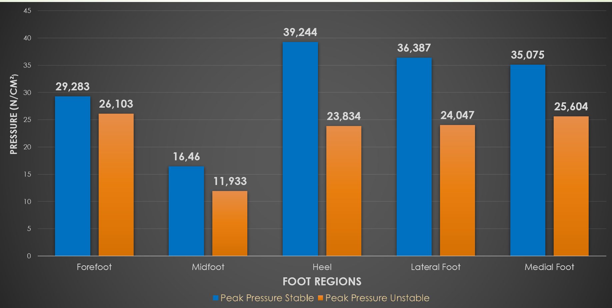

# 👣 Project: Step Into the Data – Plantar foot Pressure Analysis for Biomechanics

## Overview

* Investigated how plantar pressure distribution changes across different foot zones under static vs. dynamic conditions.
* Designed as an experimental biomechanics study, showcasing end-to-end statistical analysis.
* Goal: uncover patterns that could inform injury prevention, footwear design, and training practices.

## Methodology

* Data: Plantar pressure recordings segmented into heel, midfoot, forefoot, and toe regions.
* Design: Repeated-measures experiment – same participants tested under multiple conditions.

### Analysis pipeline:

* Descriptive statistics + assumption checks (normality).
* Repeated-measures ANOVA to detect overall differences.
* Post-hoc paired t-tests to identify specific zone/condition effects.
* Tools: Python (pandas, numpy, scipy/statsmodels), matplotlib & seaborn for visualization.

## Results & Insights

* Significant shift of pressure from heel to forefoot during dynamic tasks (p < 0.01).
* Midfoot stability found to be critical under unstable conditions.
  
### Comparison of Mean Peak Pressure between Stable & Unstable surfaces

## Key Takeaways

* Demonstrates hypothesis-driven statistical reasoning and rigorous experimental design.
* Strong example of applied data analysis beyond ML (ANOVA, t-tests, assumption checks).
* Highlights ability to derive actionable insights from biomechanical data and communicate them with clear visuals.
